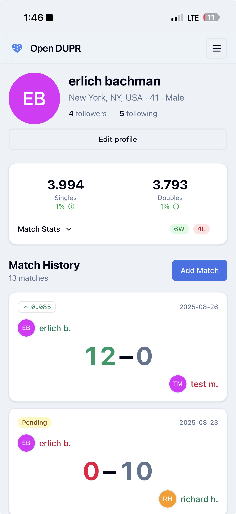
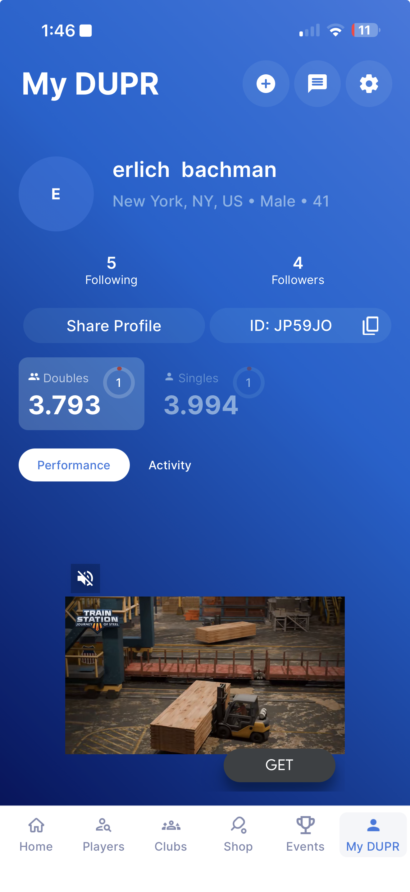
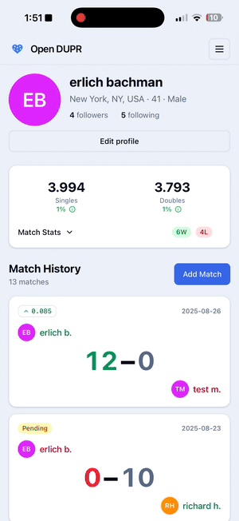

# Open DUPR

https://opendupr.com

An unofficial, fast, clean, and open-source frontend for [DUPR](https://dupr.com)

## Why

DUPR is a great rating system, but the official website and app leave a lot to be desired.

### Issues with the official DUPR website and app

- **Annoying ads, popups, upsells**
- Slow
- Unintuitive UI

### Open DUPR vs Official DUPR

| Core User Journey         | Open DUPR                                                                                                                                                                                               | Official DUPR iOS App                                                                                                                                                                                           |
| ------------------------- | ------------------------------------------------------------------------------------------------------------------------------------------------------------------------------------------------------- | --------------------------------------------------------------------------------------------------------------------------------------------------------------------------------------------------------------- |
| **Player Profile Screen** | <br/>✨ **Cleaner interface**<br/>• Simple, fast loading<br/>• All stats visible at once<br/>• No ads or distractions | <br/>📱 **Cluttered interface**<br/>• Ads on profile view<br/>• Less information visible                               |
| **Adding Match Journey**  | <br/>⚡ **Quick & streamlined**<br/>• Prioritizes followers/friends<br/>• Simple score input                  | <br/>🐌 **Complex flow**<br/>• Popups and ads galore<br/>• Longer, multi-step process<br/>• More friction to complete |

Both tested on iPhone 16 Pro Max on iOS 26 Developer Beta 9 on September 9, 2025. Open DUPR installed as a PWA. Official DUPR iOS App version 1.9.2 installed from the App Store.

## Features

- **Clean, fast interface** - No ads or distractions
- **Player profiles** - View ratings, match history, and stats
- **Match recording** - Record new matches and validate pending ones
- **Player search** - Find and follow other players
- **Social features** - Follow players and see their activity
- **PWA support** - Install as a mobile app
- **Responsive design** - Works on desktop and mobile

## Local Development

### Prerequisites

- [Bun](https://bun.sh) package manager

### Installation

```bash
cd open-dupr-react
bun install
bun run dev
```

The app will be available at `http://localhost:5173`

### Build

```bash
bun run build
```

## Tech Stack

- **React 19** with TypeScript
- **Vite** for fast development and building
- **Tailwind CSS** for styling
- **React Router** for navigation

## What's Missing?

Coming Soon™️

- Friends feed
- Player ratings on follower/following page
- Player ratings on the add teammate/opponent view
- Recent players in additon to following/followers on add teammate/opponent view
- Edit profile

## Contributing

Contributions are welcome! Please feel free to open an issue or submit a pull request.

## License

This project is licensed under the MIT License - see the [LICENSE](LICENSE) file for details.

## API

DUPR's API to their backend is pretty friendly, with a published OpenAPI spec. See [API README](./api_reference/README.md).
